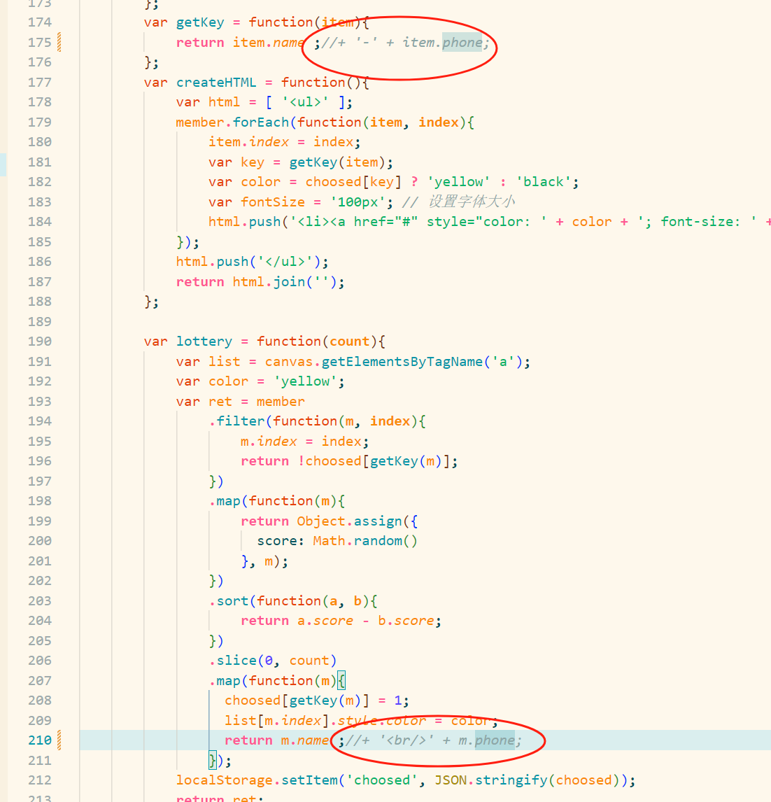
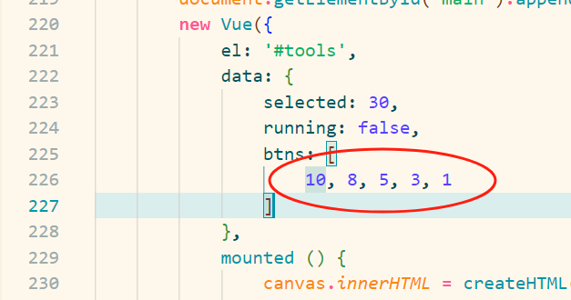

## 程序调整
#### 去除手机号展示

- ```index.html```的这两处注释掉就可以了
#### 更改背景图片
- 替换```img/icon-wall.png```即可
#### 更改字体颜色
- 都在js和css代码里,自己找吧(bushi)
#### 更改不同按钮的抽奖人数

- 改```index.html```这里的数字,如图对应按钮抽奖人数分别为10,8,5,3,1
  - 建议留个3和1备用,因为有可能现场找不到抽到的人从而需要重新抽
## 程序运行
- 用浏览器打开index.html即可成功运行
- 推荐活动进行时先本地打开index.html, 再在ppt里为其地址加上超链接,以实现丝滑切抽奖页面,请看[demo](https://iculizhi.github.io/Repositories/jswebpro-lottery2)

## 抽奖流程：
- 选择当次要抽奖的人数
- 点击『开始』按钮, 进入抽奖状态 (这个过程仍可修改抽奖人数)
- 点击『停！』按钮, 生成抽奖结果
- 点击任意人数按钮, 可以回到闲置状态,已中奖的用户标记为黄色,不会二次命中, 也就是说同一场活动可以顺序抽三,二,一等奖而不重复

PS：滚动鼠标滚轮, 可以放大或缩小球体